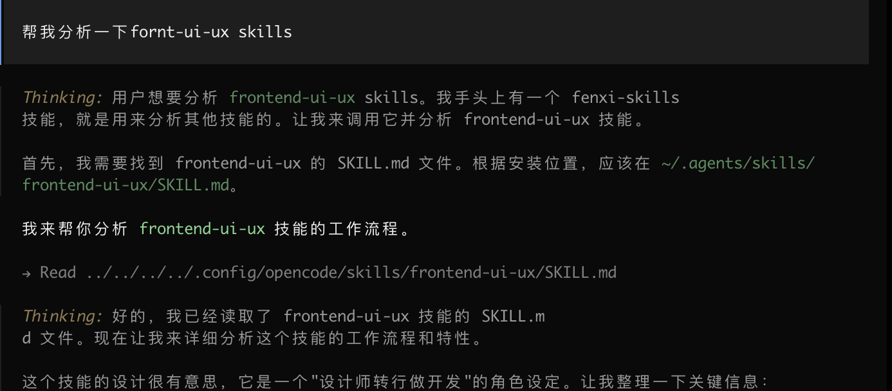

━━━━━━━━━━━━━━━━━━━━━━━━━━━━━━━━━━━━━━
📊 Skill 分析报告：fenxi-skills
━━━━━━━━━━━━━━━━━━━━━━━━━━━━━━━━━━━━━━
🎯 技能分析工具
📝 分析指定 skills 的工作流程，通过中文图文结合方式展示
┌─────────────────────────────────────┐
│ 1. 基本信息                          │
├─────────────────────────────────────┤
│                                     │
│   📛 名称: fenxi-skills              │
│   📝 描述: 分析指定 skills 的工作流程  │
│   🌐 语言: 中文                      │
│   🎨 风格: 图文结合 + ASCII 艺术      │
│                                     │
└─────────────────────────────────────┘
┌─────────────────────────────────────┐
│ 2. 核心定位                          │
├─────────────────────────────────────┤
│                                     │
│   🔍 这是一个"元技能"(Meta Skill)    │
│                                     │
│   它不做具体工作，而是帮助用户理解    │
│   其他技能的工作方式。相当于技能的    │
│   "说明书生成器"。                   │
│                                     │
│   💡 解决的问题：                    │
│   • 安装了很多技能但不知道有什么用    │
│   • 想了解某个技能的具体工作流程      │
│   • 需要快速掌握新技能的使用方法      │
│                                     │
└─────────────────────────────────────┘
┌─────────────────────────────────────┐
│ 3. 四步分析流程                      │
├─────────────────────────────────────┤
│                                     │
│   🔎 步骤 1: 确认技能存在性           │
│   ━━━━━━━━━━━━━━━━━━━━━━━━         │
│   搜索目标 skill 的 SKILL.md 文件：   │
│                                     │
│   📁 项目级: .opencode/skills/       │
│   🏠 全局: ~/.config/opencode/       │
│   🔧 Claude: .claude/skills/         │
│                                     │
│   ⚠️  如果未找到 → 提示不存在         │
│      并列出所有可用 skills            │
│                                     │
│   ─────────────────────────────────  │
│                                     │
│   📖 步骤 2: 读取技能内容             │
│   ━━━━━━━━━━━━━━━━━━━━━━━━         │
│   解析 SKILL.md 的完整内容：          │
│                                     │
│   • YAML Frontmatter                 │
│     - name, description              │
│     - metadata 等                    │
│                                     │
│   • 正文内容                         │
│   • 引用的资源/文档                  │
│                                     │
│   ─────────────────────────────────  │
│                                     │
│   🧠 步骤 3: 工作流程分析             │
│   ━━━━━━━━━━━━━━━━━━━━━━━━         │
│   深入分析技能的 5 个维度：            │
│                                     │
│   ① 目的和目标                       │
│      → 这个 skill 为了解决什么问题？   │
│                                     │
│   ② 适用场景                         │
│      → 什么时候应该使用这个 skill？    │
│                                     │
│   ③ 执行步骤                         │
│      → 具体的工作流程和步骤           │
│                                     │
│   ④ 关键依赖                         │
│      → 需要哪些工具/配置/外部资源      │
│                                     │
│   ⑤ 使用示例                         │
│      → 如何在实际项目中应用           │
│                                     │
│   ─────────────────────────────────  │
│                                     │
│   🎨 步骤 4: 图文结合展示             │
│   ━━━━━━━━━━━━━━━━━━━━━━━━         │
│   使用 ASCII 艺术 + 中文展示：         │
│                                     │
│   • 📋 基本信息卡片                  │
│   • 🔄 流程图 (Mermaid/ASCII)        │
│   • 📝 步骤详解                      │
│   • 💡 使用技巧                      │
│                                     │
└─────────────────────────────────────┘
┌─────────────────────────────────────┐
│ 4. 输出格式规范                      │
├─────────────────────────────────────┤
│                                     │
│   标准化报告结构：                    │
│                                     │
│   ━━━━━━━━━━━━━━━━━━━━━━━━━━━━━━   │
│   📊 Skill 分析报告                   │
│   ━━━━━━━━━━━━━━━━━━━━━━━━━━━━━━   │
│                                     │
│   🎯 [技能名称]                      │
│   📝 [描述信息]                      │
│                                     │
│   ┌─────────────────────────────┐   │
│   │ 1. 基本信息                  │   │
│   ├─────────────────────────────┤   │
│   │ • 名称: xxx                  │   │
│   │ • 描述: xxx                  │   │
│   │ • 授权: MIT                 │   │
│   └─────────────────────────────┘   │
│                                     │
│   ┌─────────────────────────────┐   │
│   │ 2. 工作流程                  │   │
│   │     [开始] → [步骤] → [结束] │   │
│   └─────────────────────────────┘   │
│                                     │
│   ┌─────────────────────────────┐   │
│   │ 3. 详细步骤                  │   │
│   │ ▸ 步骤 1: xxx               │   │
│   │   - 子步骤                   │   │
│   └─────────────────────────────┘   │
│                                     │
│   ┌─────────────────────────────┐   │
│   │ 4. 适用场景                  │   │
│   │ ✓ 适用: xxx                 │   │
│   │ ✗ 不适用: xxx               │   │
│   └─────────────────────────────┘   │
│                                     │
│   ━━━━━━━━━━━━━━━━━━━━━━━━━━━━━━   │
│                                     │
└─────────────────────────────────────┘
┌─────────────────────────────────────┐
│ 5. 使用技巧                          │
├─────────────────────────────────────┤
│                                     │
│   ✅ 最佳实践：                      │
│                                     │
│   1. 提供准确的 skill 名称            │
│      → 区分大小写                    │
│      → 例如: "frontend-ui-ux"       │
│                                     │
│   2. 不确定名称时                     │
│      → 先问"列出所有可用的 skills"    │
│      → 从列表中选择                   │
│                                     │
│   3. 查看分析结果中的实用建议          │
│      → 适用场景指导                   │
│      → 注意事项提醒                   │
│                                     │
└─────────────────────────────────────┘
┌─────────────────────────────────────┐
│ 6. 注意事项                          │
├─────────────────────────────────────┤
│                                     │
│   ⚠️  限制条件：                     │
│                                     │
│   • 只能分析已安装的 skills           │
│     → 需要先使用 `skills add` 安装    │
│                                     │
│   • 某些 skills 可能需要特定权限      │
│     → 取决于 skill 本身的设计         │
│                                     │
│   • 分析过程会显示 skill 完整内容      │
│     → 确保不包含敏感信息              │
│     → 审查后再分享                   │
│                                     │
└─────────────────────────────────────┘
┌─────────────────────────────────────┐
│ 7. 适用场景                          │
├─────────────────────────────────────┤
│                                     │
│   ✓ 适合使用：                       │
│                                     │
│   • 刚安装新技能，想了解怎么用         │
│   • 团队协作时需要文档化技能用法        │
│   • 评估某个技能是否适合当前项目        │
│   • 学习和研究其他技能的设计思路        │
│                                     │
│   ✗ 不适合使用：                     │
│                                     │
│   • 技能还未安装                     │
│   • 需要执行具体任务（它只分析不执行）   │
│   • 寻找某个功能的实现代码             │
│                                     │
└─────────────────────────────────────┘
┌─────────────────────────────────────┐
│ 8. 使用示例                          │
├─────────────────────────────────────┤
│                                     │
│   💬 对话示例：                      │
│                                     │
│   用户: "分析 git-release 这个 skill" │
│   ↓                                  │
│   AI:  [开始执行 4 步分析流程]        │
│   ↓                                  │
│   AI:  [输出完整分析报告]             │
│                                     │
│   ─────────────────────────────────  │
│                                     │
│   💬 对话示例：                      │
│                                     │
│   用户: "用 fenxi-skills 分析一下     │
│          pr-review"                  │
│   ↓                                  │
│   AI:  [定位到 fenxi-skills 技能]     │
│   ↓                                  │
│   AI:  [使用 fenxi-skills 分析        │
│          pr-review 技能]             │
│   ↓                                  │
│   AI:  [输出 pr-review 的分析报告]    │
│                                     │
└─────────────────────────────────────┘
┌─────────────────────────────────────┐
│ 9. 核心优势                          │
├─────────────────────────────────────┤
│                                     │
│   🌟 独特价值：                      │
│                                     │
│   1. 🀄 中文原生                      │
│      专为中文用户设计，解释清晰        │
│                                     │
│   2. 🎨 视觉友好                      │
│      ASCII 艺术 + 结构化展示          │
│      阅读体验好                       │
│                                     │
│   3. 📊 标准化输出                    │
│      统一的报告格式，便于对比          │
│      不同技能的特点                   │
│                                     │
│   4. 🔍 系统化分析                    │
│      5 个维度的深入分析，不遗漏        │
│      关键信息                         │
│                                     │
└─────────────────────────────────────┘
━━━━━━━━━━━━━━━━━━━━━━━━━━━━━━━━━━━━━━
💡 总结
fenxi-skills 是一个技能分析工具，它：
1. 定位独特：作为"元技能"，帮助理解其他技能
2. 流程清晰：4 步分析法（确认→读取→分析→展示）
3. 输出规范：标准化的 ASCII 艺术报告
4. 中文优化：专为中文用户设计的展示方式
核心价值：让用户快速掌握任何已安装技能的使用方法和工作原理！